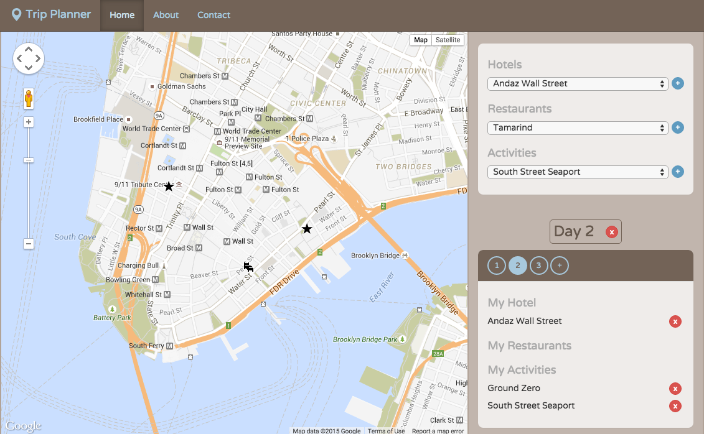
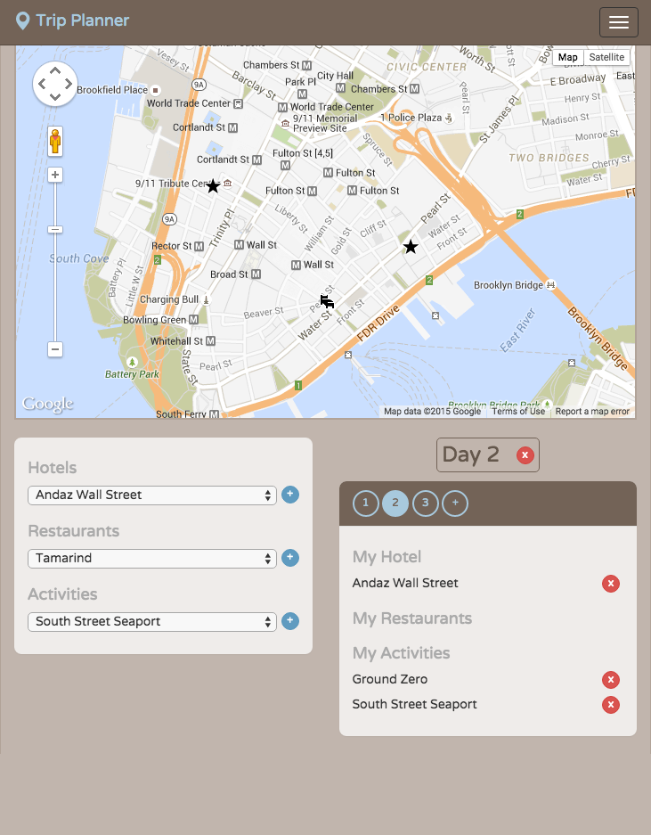

# What this is

### Overview

Over the past weeks, we have written apps like Twitter.js and Wikistack that featured a dynamic backend able to listen to HTTP requests, store and manipulate data, and return newly-generated HTML+CSS to the client.

We also built one front-end application (Game of Life) that used JS in the browser. However, none of these were truly full-stack — using JS in both the back- and front-ends and communicating seamlessly between the two.

It's time for that to change. In the next series of workshops, you'll be writing a really cool Single-Page App (SPA) that not only stores and manipulates data on the server, but intelligently updates sections of the browser page using AJAX, DOM manipulation, and 3rd-party APIs.

### Trip Planner

Isn't it a pain to come up with and organize travel plans? As a creative programmer, you've decided to solve this problem by building an app to easily manage day-by-day itineraries. Trip Planner is far too amazing to be contained in any one workshop, so we've broken it into three phases:

1. Static UI (this workshop)
2. Live UI
3. Persistence

For this first phase, we will focus ONLY in the browser. We will start by talking about how to organize complex front-end applications using modules. We already used modules on node - but not yet in the browser.

# How to run

No need to run any server - just open `public/index.html`. But if you want to edit it you need to `npm start` from the root directory and that will kick off webpack in watch mode.

# check it live

the prebuilt site is viewable here: <https://sw-yx.github.io/fsa-tripplanner-static/public/>

# Notes from @swyx

This project introduces webpack configuration for the first time, serving files, transpiling sass, bundling js. so the `webpack.config.js` file is key here and also check out the devDependencies

Bootstrap is used heavily here.

The mapbox api is used to provide the maps.

You are basically just given an image mockup and you are expected to make the whole thing from there.

